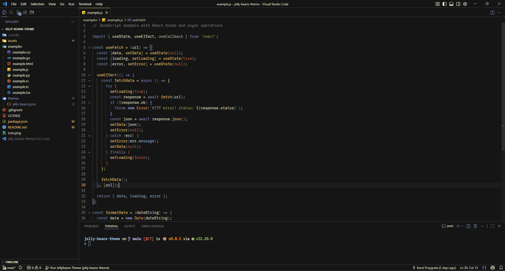
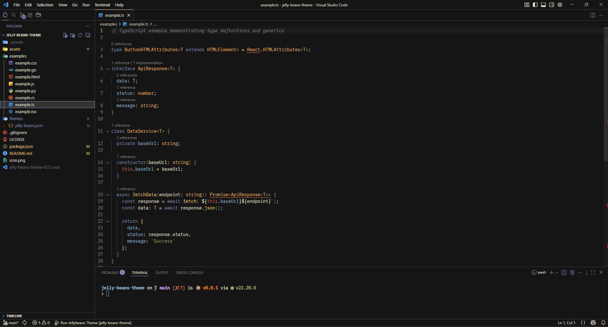
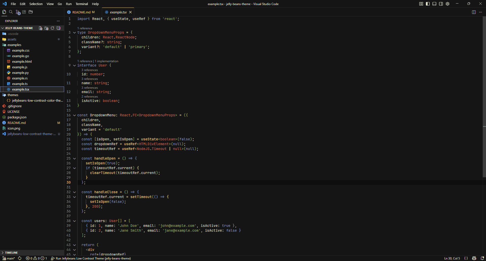
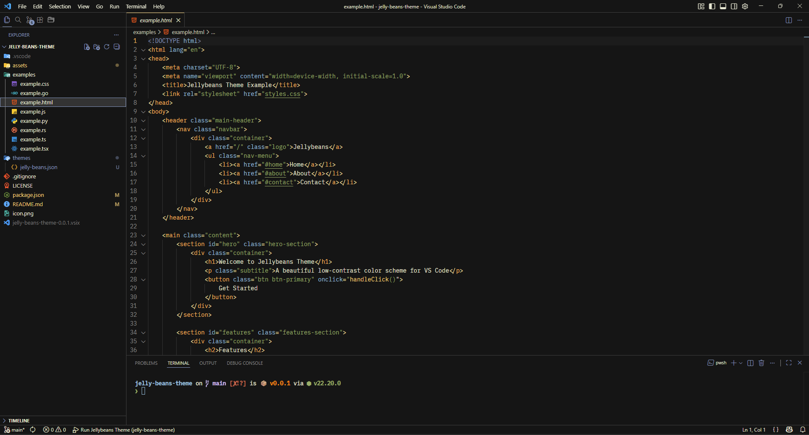
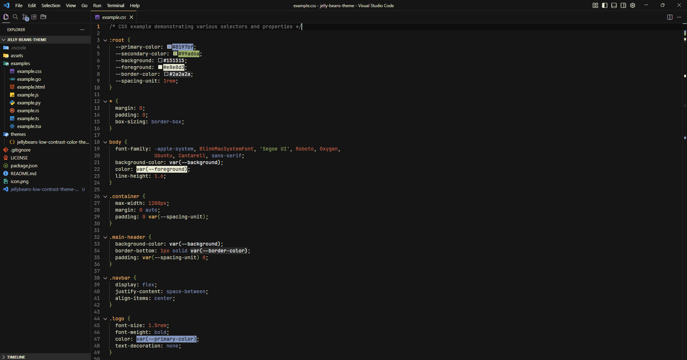
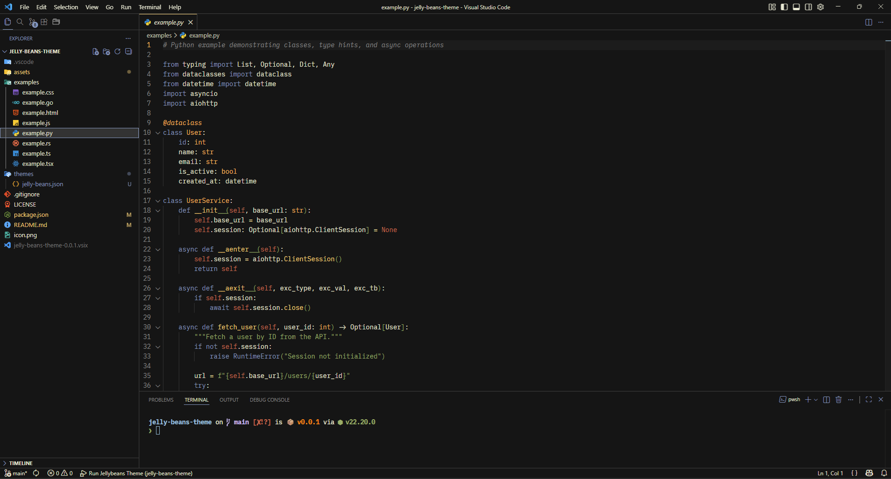
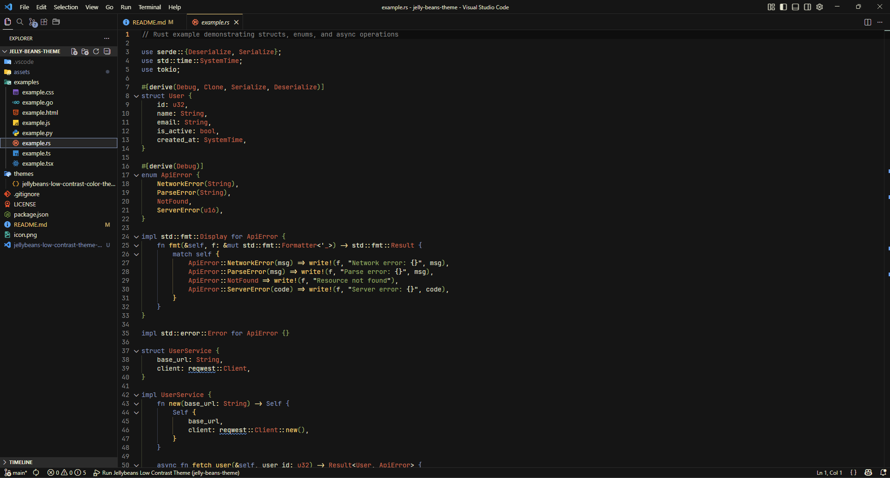
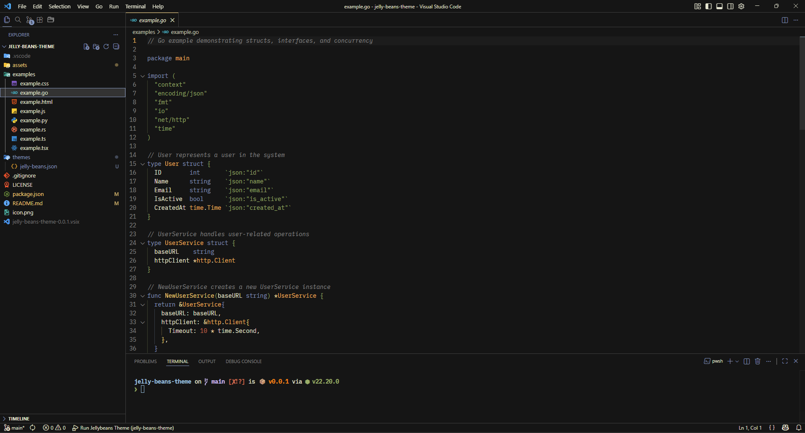
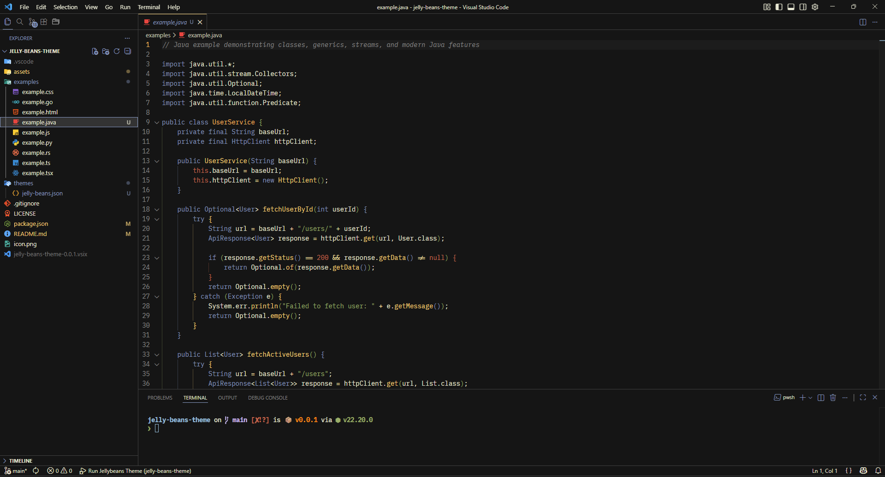

# Jelly Beans – VS Code Theme

A port of the classic **jellybeans.vim** color scheme for VS Code, featuring consistent syntax highlighting, subtle borders, and a cohesive dark aesthetic.

> **Disclaimer**: This theme was created for personal use and may contain edge cases or incomplete coverage for certain language features or VS Code UI elements. Use at your own discretion.

## Features

- **Low-contrast workbench** – Most UI elements use a background color very close to `editor.background` (`#151515`)
- **Subtle borders instead of high-contrast backgrounds** for panels, sidebars, and lists
- **Consistent semantic coloring** – Functions (including built-in functions like `fetch()`) use the same color (`#fad07a`) throughout
- **Type highlighting** – All types (including primitives like `boolean`, `void`) are bold and use `#ffb65c`
- **Property highlighting** – Object properties accessed via dot notation use `#8fbfdc` with italic styling
- **Parameter highlighting** – Function parameters are styled with italic for better readability
- **Git decorations** styled with Jellybeans palette colors
- **Bracket pair colorization** matching the theme's color scheme

## Screenshots

### JavaScript



### TypeScript



### React TypeScript



### HTML



### CSS



### Python



### Rust



### GO



### Java



## Installation

### Local Development

1. Open this folder in VS Code (`File -> Open Folder...`)
2. Press `F5` to launch the "Extension Development Host"
3. In the new VS Code window, go to `Preferences -> Color Theme` and select **Jelly Beans**

### Build Package

To create a `.vsix` package for distribution:

```bash
npm install -g @vscode/vsce
vsce package
```

Then install the generated `.vsix` file via `Extensions -> ... -> Install from VSIX`

## Color Palette

Based on the original Jellybeans.vim palette:

### Base Colors
- **Foreground**: `#e8e8d3`
- **Background**: `#151515`
- **Comments**: `#888888` (italic)

### Syntax Colors
- **Functions & Methods**: `#fad07a` (Goldenrod) – includes built-in functions like `fetch()`, `console.log()`
- **Types** (bold): `#ffb65c` (Koromiko) – classes, interfaces, type aliases, primitive types
- **Properties** (italic): `#8fbfdc` (Morning Glory) – object properties accessed via dot notation
- **HTML Properties**: `#8fbfdc` (Morning Glory)
- **Keywords**: `#8197BF` (Ship Cove) – language keywords, operators
- **Operators**: `#ffe2a9`
- **Strings**: `#99ad6a` (Green Smoke)
- **Numbers & Constants**: `#cf6a4c` (Raw Sienna) – numeric literals, `null`, `undefined`, `true`, `false`
- **Variables & Parameters** (italic): `#e8e8d3` – regular variables and function parameters

### Typography
- **Types**: Bold
- **Properties**: Italic
- **Function Parameters**: Italic
- **Comments**: Italic

## Examples

See the `examples/` directory for code samples in various languages demonstrating the theme's syntax highlighting.

## Credits

- Original Jellybeans theme: [nanotech/jellybeans.vim](https://github.com/nanotech/jellybeans.vim)
- Ported and adapted for VS Code with low-contrast workbench styling

## License

MIT License - see [LICENSE](LICENSE) file for details.
